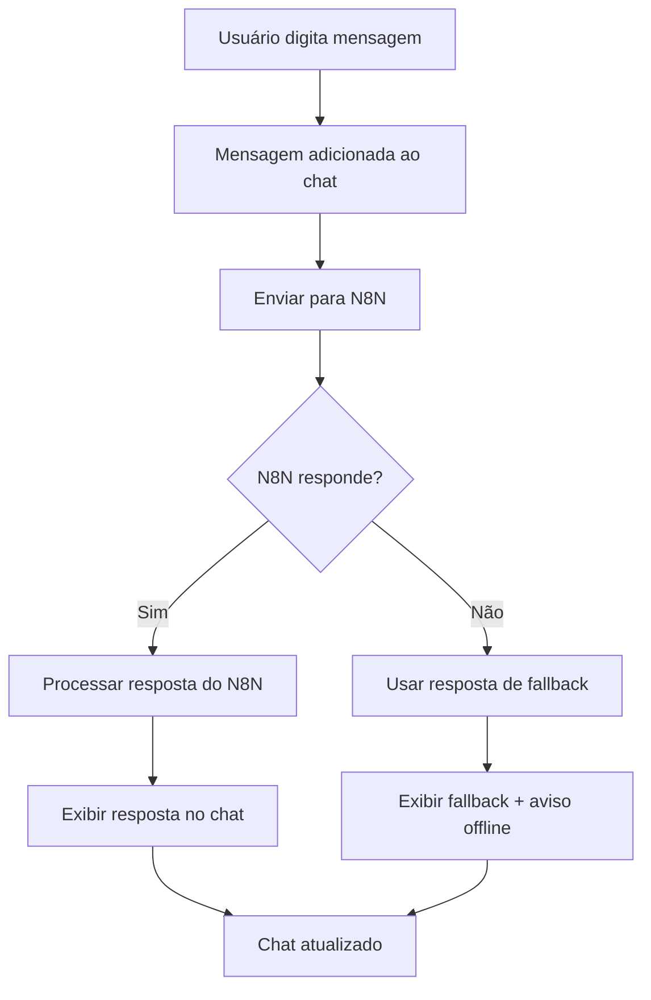

# Integração do Chatbot com N8N

## Resumo da Implementação

O Assistente de Produtividade foi integrado com o N8N para processar as perguntas dos usuários através de inteligência artificial, ao invés de usar respostas pré-definidas localmente.

## Modificações Realizadas

### 1. URL do Webhook N8N
- **URL configurada**: `https://filial96.app.n8n.cloud/webhook-test/AssistentedeProdutividade`
- **Método**: POST
- **Content-Type**: application/json

### 2. Estrutura da Requisição

As mensagens enviadas para o N8N contêm:
```json
{
  "message": "Pergunta do usuário",
  "timestamp": "2024-01-01T10:00:00.000Z",
  "source": "ProductivityAssistant"
}
```

### 3. Processamento de Respostas

O sistema tenta processar a resposta do N8N de diferentes formas:
1. **Resposta estruturada**: `data.response`
2. **Mensagem direta**: `data.message`
3. **Conteúdo bruto**: String ou JSON serializado

### 4. Sistema de Fallback

Em caso de falha na comunicação com o N8N:
- ✅ Respostas básicas locais são utilizadas
- ⚠️ Banner de aviso é exibido ("Modo offline ativo")
- 🟡 Indicador visual de status (bolinha amarela)
- 📱 Funcionalidade continua disponível

### 5. Indicadores Visuais de Status

#### Status Online (N8N funcionando)
- 🟢 Bolinha verde no header
- 📝 Texto: "Conectado à IA • Online"

#### Status Offline (N8N indisponível)
- 🟡 Bolinha amarela no header  
- 📝 Texto: "Modo offline ativo"
- ⚠️ Banner amarelo com aviso

### 6. Tratamento de Erros

- **Timeout**: Aguarda resposta do N8N
- **Erro de rede**: Automaticamente usa fallback
- **Resposta inválida**: Tenta processar diferentes formatos
- **Console logs**: Erros são registrados para debug

## Fluxo de Funcionamento



## Configuração do N8N

### Webhook Endpoint
O N8N deve estar configurado para:
1. **Receber requisições POST** na URL especificada
2. **Processar o campo `message`** da requisição
3. **Retornar uma resposta estruturada**:
   ```json
   {
     "response": "Resposta da IA para o usuário"
   }
   ```

### Formato de Resposta Recomendado
```json
{
  "response": "Sua resposta aqui",
  "status": "success",
  "timestamp": "2024-01-01T10:00:00.000Z"
}
```

## Benefícios da Integração

### ✅ Vantagens
- **IA Real**: Respostas inteligentes e contextualmente relevantes
- **Escalabilidade**: N8N pode integrar com diferentes provedores de IA
- **Flexibilidade**: Fácil modificação das respostas no N8N
- **Confiabilidade**: Sistema de fallback garante funcionamento contínuo
- **Monitoramento**: Logs detalhados para acompanhar performance

### 🔄 Funcionalidades Mantidas
- **Interface responsiva**: Funciona em desktop e mobile
- **Histórico de conversas**: Mantém mensagens durante a sessão
- **Sugestões rápidas**: Botões com perguntas comuns
- **Copiar mensagens**: Usuário pode copiar respostas da IA
- **Minimizar/Expandir**: Controle de visibilidade
- **Loading states**: Animações durante processamento

## Testando a Integração

### 1. Teste Online (N8N funcionando)
- Envie uma mensagem no chatbot
- Verifique se aparece "Conectado à IA • Online"
- Confirme se a resposta vem do N8N

### 2. Teste Offline (N8N indisponível)
- Simule falha no N8N (desconecte internet temporariamente)
- Envie uma mensagem
- Confirme modo offline ativo e fallback funcionando

### 3. Verificar Logs
- Abra o Console do navegador (F12)
- Envie mensagens e verifique logs de requisições
- Confirme que erros são tratados adequadamente

## Próximos Passos Sugeridos

1. **Configurar o workflow no N8N** para processar as mensagens
2. **Integrar com provedor de IA** (OpenAI, Anthropic, etc.)
3. **Personalizar respostas** baseadas no contexto do Hub de Produtividade
4. **Adicionar análise de sentimento** para respostas mais empáticas
5. **Implementar histórico persistente** (salvando conversas no banco)

## Arquivos Modificados

- `src/components/moveis/hub-produtividade/components/chatbot/ProductivityAssistant.tsx`

---

**Status**: ✅ Implementação Concluída  
**Data**: $(date '+%d/%m/%Y')  
**Versão**: 1.0 