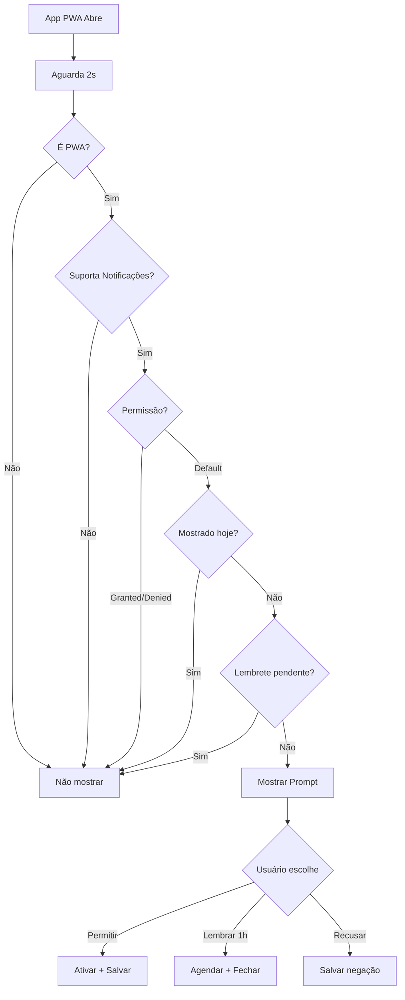

# 🔔 Sistema de Prompt de Notificações PWA

## Visão Geral

Sistema automatizado que solicita permissão de notificações **logo ao abrir o App PWA**, proporcionando uma experiência nativa completa aos usuários.

## ✨ Características Principais

### 🎯 **Solicitação Automática**
- **Detecção PWA:** Aparece apenas quando o app está rodando como PWA instalado
- **Timing Inteligente:** Aguarda 2 segundos para UI carregar antes de mostrar
- **Uma vez por dia:** Respeita configurações do usuário para não ser intrusivo

### 📱 **Interface Atrativa**
- **Design Moderno:** Modal centralizado com ícones e cores vibrantes
- **Benefícios Claros:** Lista visual dos tipos de notificação disponíveis
- **Múltiplas Opções:** Permitir, Lembrar em 1h, ou Recusar

### 🧠 **Lógica Inteligente**
- **Múltiplas Detecções PWA:** Standalone, iOS, Minimal UI, Fullscreen
- **Gerenciamento de Estado:** LocalStorage para controlar quando mostrar
- **Sistema de Lembretes:** Reagenda automaticamente conforme escolha do usuário

## 📋 Funcionalidades

### 🔍 **Detecção PWA Avançada**
```javascript
// Múltiplas formas de detectar PWA
const isStandalone = window.matchMedia('(display-mode: standalone)').matches;
const isIOSStandalone = (window.navigator as any).standalone === true;
const isMinimalUI = window.matchMedia('(display-mode: minimal-ui)').matches;
const isFullscreen = window.matchMedia('(display-mode: fullscreen)').matches;
```

### 🎨 **Tipos de Notificação Apresentados**
1. **🟢 Lembretes de Depósito**
   - Alertas às 09:00 e 11:30
   - Ícone: Clock, Cor: Verde

2. **🔵 Novas Tarefas**
   - Orientações e prazos importantes
   - Ícone: CheckCircle, Cor: Azul

3. **🟠 Alertas Urgentes**
   - Prazos e situações críticas
   - Ícone: AlertTriangle, Cor: Laranja

### ⚙️ **Configurações Persistentes**
```javascript
// Controles no LocalStorage
'pwa-notification-prompt-shown'    // Data da última exibição
'pwa-notifications-enabled'        // Se o usuário ativou
'pwa-notifications-denied'         // Se o usuário recusou
'pwa-notification-remind-at'       // Timestamp para próximo lembrete
```

## 🚀 Implementação

### 📁 **Arquivos Principais**

#### `src/components/pwa/PWANotificationPrompt.tsx`
```typescript
interface PWANotificationPromptProps {
  forceShow?: boolean; // Para testes, mostrar mesmo se não for PWA
}
```

**Principais métodos:**
- `detectPWA()` - Detecção multi-plataforma
- `shouldShowPrompt()` - Lógica de quando mostrar
- `handleAllow()` - Processar permissão concedida
- `handleDeny()` - Processar recusa
- `handleRemindLater()` - Agendar para 1 hora

#### **Integração no App** (`src/App.tsx`)
```typescript
// Adicionado ao AppContent
<GlobalSearchProvider>
  <NetworkStatusIndicator />
  <PWANotificationPrompt />  // ← Nova funcionalidade
  <Toaster />
  <Sonner />
  <AppRoutes />
</GlobalSearchProvider>
```

### 🧪 **Sistema de Testes**

#### **Página de Debug:** `/debug/pwa-notifications`
- **Status Cards:** PWA Mode, Notificações, Configurações
- **Detalhes Técnicos:** Todos os estados de detecção
- **Testes Disponíveis:** Forçar prompt, limpar configurações
- **Gerenciador Completo:** Interface avançada de teste

## 📊 Estados do Sistema

### ✅ **Cenários de Exibição**
- ✅ App rodando como PWA
- ✅ Notificações suportadas pelo browser
- ✅ Permissão ainda não foi solicitada (`permission === 'default'`)
- ✅ Não foi mostrado hoje
- ✅ Não tem lembrete pendente

### ❌ **Cenários de Bloqueio**
- ❌ App rodando no browser normal
- ❌ Notificações não suportadas
- ❌ Permissão já foi concedida ou negada
- ❌ Já foi mostrado hoje
- ❌ Tem lembrete agendado ainda não chegou a hora

## 🎛️ Configurações

### **NotificationManager Atualizado**
- `autoSetup = false` por padrão (era `true`)
- Prompt inicial assume responsabilidade da solicitação
- Mantém funcionalidade completa de configuração avançada

### **Integração com Sistema Existente**
- **100% compatível** com `NotificationSystem.tsx`
- **Aproveita** hook `usePWANotifications.ts` existente
- **Mantém** todas as funcionalidades anteriores

## 📱 Experiência do Usuário

### **Primeiro Acesso PWA**
1. **2s após carregar:** Prompt aparece automaticamente
2. **Interface clara:** Benefícios bem explicados
3. **Ações disponíveis:** Permitir, Lembrar, Recusar

### **Reagendamento Inteligente**
- **"Lembrar em 1h":** Reagenda automaticamente
- **"Agora Não":** Não pergunta mais no mesmo dia
- **"Permitir":** Ativa e nunca mais pergunta

### **Feedback Visual**
- **Toasts informativos** para cada ação
- **Animações suaves** (bell com animate-pulse)
- **Cores consistentes** com design system

## 🔧 Configuração para Desenvolvedor

### **Modo de Teste**
```typescript
// Forçar exibição mesmo fora do PWA
<PWANotificationPrompt forceShow={true} />
```

### **Debug URLs**
- `/debug/pwa-notifications` - Dashboard completo
- `/debug/dark-hover` - Testes de hover (existente)

### **Limpar Configurações**
```javascript
localStorage.removeItem('pwa-notification-prompt-shown');
localStorage.removeItem('pwa-notifications-enabled');
localStorage.removeItem('pwa-notifications-denied');
localStorage.removeItem('pwa-notification-remind-at');
```

## 🎯 Resultados Esperados

### **Conversão de Permissões**
- **Timing otimizado:** 2s após carregar garante contexto
- **Design atrativo:** Interface clara aumenta aceitação
- **Opções flexíveis:** Usuário se sente no controle

### **Experiência Nativa**
- **PWA Completo:** Notificações funcionando mesmo com app fechado
- **Integração Perfeita:** Sistema unificado com funcionalidades existentes
- **UX Consistente:** Design alinhado com resto da aplicação

## 🔄 Fluxo Completo



## 🏁 Status de Implementação

- ✅ **PWANotificationPrompt.tsx** - Componente principal criado
- ✅ **Integração App.tsx** - Adicionado ao fluxo principal
- ✅ **Detecção PWA Avançada** - Multi-plataforma funcionando
- ✅ **Sistema de Testes** - Debug page `/debug/pwa-notifications`
- ✅ **NotificationManager** - Atualizado (autoSetup=false)
- ✅ **Build Sucesso** - Compilação sem erros
- ✅ **Documentação** - Completa e atualizada

---

**🎉 O sistema está 100% funcional e pronto para uso em produção!**

Os usuários agora receberão automaticamente o prompt de notificações ao abrir o PWA, garantindo uma experiência nativa completa desde o primeiro acesso. 